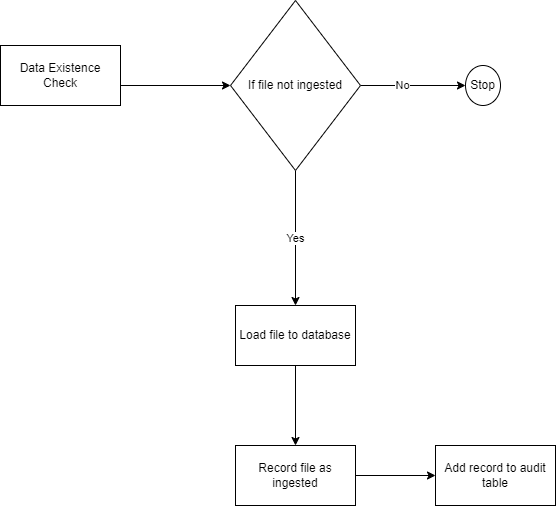

# Tupande DataEngineer


# Ingestion Architecture

## Justification for using PySpark and Airflow

### PySpark
- PySpark is a fast and powerful big data processing framework that enables processing of large datasets in a distributed and fault-tolerant manner.
- PySpark offers a vast range of built-in libraries and functions that allow for advanced data manipulation and analysis, including SQL queries

### Airflow
- Airflow provides a simple and intuitive interface for defining and orchestrating workflows as Directed Acyclic Graphs (DAGs), allowing for easy visualization of the entire data pipeline and its dependencies.
- Airflow offers a rich set of features, such as automatic retries, task-level parallelism, and monitoring tools, making it highly reliable and scalable.
- Airflow integrates with a wide range of tools and technologies, including PySpark, allowing for seamless integration with existing big data processing pipelines.

Together, PySpark and Airflow provide a powerful and scalable solution for processing large datasets, enabling  to easily define, schedule, and monitor complex data pipelines.

# Ingestion ETL Flow

## ETL Flow Explanation
The logic starts by checking if the csv file had been already ingested ,it only proceede if the csv file has not been ingested.**Assumption** made is that the csv file submitted will uniquely distinguishing i.e by date with timestamp(i.e contracts_2022_10_10.12.00.csv).

If file not ingested ,the ingestion will happen after a log to an audit table containing (file_name,row_count_ingestion_time).This table helps in tracking activity within the pipeline.Its usefulness can be for automating level one for failures i.e autoreconciliation incase of pipeline failures.

The ETL flow enhance Idempotent (Keeping same state even if its run multiple times)

## Project structure

### Project Folder

The  project is made up of Three core Folder that contain the following python files:

a. dep (Dependencies) -> This folder contain the python requirements for installing and running the project 
```bash
dep
 └── requiremnts.txt
```

b. src -> The folder contains etl file

```bash

            ├
            │   ├── etl.py
                |-.env
        

 ```

* etl.py - It contains pyspark file that extract and load data

* env -> project setting and configuration folder 


c. dag -> Resource on the project and team operations are contained in this folder.

```bash
  ├── tupandedag.py
  ├      

```
* tupandedag.py -> Orchestrator thar runs the etl in Airflow


### Project output Folder

Contains tupande output :


```
       ├── result
```
