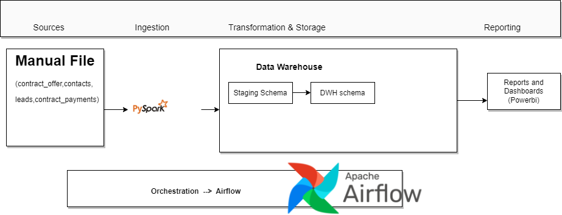

# Tupande DataEngineer

# Ingestion

## Justification for using PySpark and Airflow

### PySpark
- PySpark is a fast and powerful big data processing framework that enables processing of large datasets in a distributed and fault-tolerant manner.
- PySpark offers a vast range of built-in libraries and functions that allow for advanced data manipulation and analysis, including SQL queries, machine learning, and graph processing.

### Airflow
- Airflow provides a simple and intuitive interface for defining and orchestrating workflows as Directed Acyclic Graphs (DAGs), allowing for easy visualization of the entire data pipeline and its dependencies.
- Airflow offers a rich set of features, such as automatic retries, task-level parallelism, and monitoring tools, making it highly reliable and scalable.
- Airflow integrates with a wide range of tools and technologies, including PySpark, allowing for seamless integration with existing big data processing pipelines.

Together, PySpark and Airflow provide a powerful and scalable solution for processing large datasets, enabling  to easily define, schedule, and monitor complex data pipelines.
